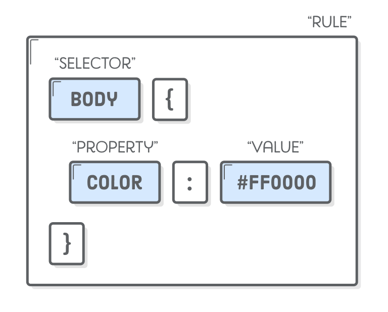

# CSS Basics

*Does anyone know what CSS stands for?*
*What is it used for?*

### Let's match the following concepts:

* HTML
* CSS
* JS

* Interactivity
* Structure
* Presentation

### CSS Stylesheets

* Move into the directory called 'css-basics'
* Add a file called 'style.css'
*What is the command to add a file?*

* CSS stylesheets are made up of *rules*, which are made up of *selectors*, *properties* and *values*



* Let's add this rule to our stylesheet

* How can we link a stylesheet to an html page?
``` html
  <link rel='stylesheet' href='path' />
```

* *rel* defines the relationship between the HTML document and the resource.

* We can also code stylesheets inline and on specific elements.


### Selecting elements

``` css
body {
color: #414141;               /* Dark gray */
background-color: #EEEEEE;    /* Light gray */
}

h1 {
font-size: 36px;
}

h2 {
  font-size: 28px;
}
```

### Units of Measure

* Units of measure are often misused and misunderstood by developers and designers, which leads to a lot of hacky css.

* [There are a lot of units of measure](https://developer.mozilla.org/en-US/docs/Web/CSS/length) in css but the three most common are px, em, and rem.
  * px represents the physical reference pixel; other units are defined relative to it
  * em Represents the calculated font-size of the element. If used on the font-size property itself, it represents the inherited font-size of the element.
  * rem Represents the font-size of the root element (typically <html>). When used within the root element font-size, it represents its initial value (a common browser default is 16px, but user-defined preferences may modify this).

### Selecting more than one element

* Let's *refactor* this:

```css
h1 {
  font-family: "Helvetica", "Arial", sans-serif;
}

h2 {
  font-family: "Helvetica", "Arial", sans-serif;
}

h3 {
  font-family: "Helvetica", "Arial", sans-serif;
}
```

### Define Fonts

* `font-family` recieves multiple values and defaults to the first that is available
* Relying on built-in fonts is limiting and typically you'll manually add fonts. *How?? Links.*

```
font-family: "Oswald", helvetica, sans-serif
```

### List Styles

```css
ul {
  list-style-type: circle;
}

ol {
  list-style-type: lower-roman;
}
```

* There is also `list-style-type: none;` which is often used for nav bars.  This is a good example of using HTML for STRUCTURE and CSS for PRESENTATION


### Reusing Stylesheets/Other ways to style
* Separate Stylesheets
* Inline styling
* Embedding stylesheets

```css
<style type="text/css">
  selector(s) {
    property: value;
    property: value;
    property: value;
  }
</style>
```


### Other Common Styles

* Underlines
```css
a {
  text-decoration: none;
}
```

*Try the following on your own*
* [Text alignment](https://www.w3schools.com/cssref/pr_text_text-align.asp) `text-align: left`
* [Font weight](https://www.w3schools.com/cssref/pr_font_weight.asp)
* [Font style](https://www.w3schools.com/cssref/pr_font_font-style.asp)
